# Integración n8n + Google Sheets

Este proyecto documenta paso a paso cómo conectar un flujo de **n8n** (alojado en una máquina virtual DietPi) con **Google Sheets**, usando un webhook que recibe datos por `POST` y los escribe automáticamente en una hoja de cálculo.

##  Requisitos previos

- Una cuenta de Google con acceso a [Google Cloud Console](https://console.cloud.google.com/)
- Una instancia de n8n en funcionamiento (en este caso, sobre una VM DietPi)
- Acceso a línea de comandos (`cmd`) para probar el webhook con `curl`

##  Pasos de configuración

### 1. Habilitar las APIs necesarias en Google Cloud

Antes de nada, hay que habilitar dos APIs en el proyecto de Google Cloud:

- **Google Drive API**
- **Google Sheets API**

| Google Drive API | Google Sheets API |
|---|---|
| 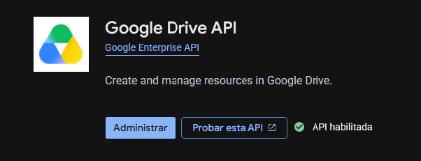 | 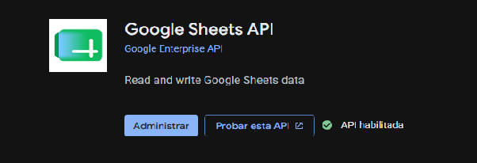 |

### 2. Crear una cuenta de servicio

Con ambas APIs habilitadas, el siguiente paso es generar una **cuenta de servicio**, que es la que usará n8n para autenticarse contra Google sin intervención manual.

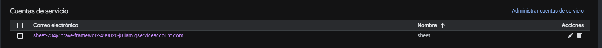

### 3. Generar la clave de la cuenta de servicio

Se genera una clave para la cuenta de servicio y se descarga en formato **JSON**, guardándola en el equipo local.

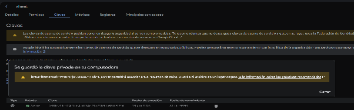

### 4. Crear la hoja de Google Sheets y dar permisos

Se crea un nuevo Google Sheet y se le otorga **rol de editor** a la cuenta de servicio (usando el correo de la cuenta de servicio, que aparece en el JSON descargado).

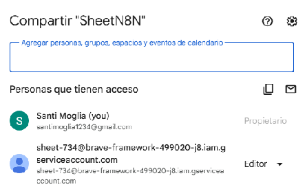

### 5. Configurar el Webhook en n8n

Desde la máquina virtual DietPi, se abre n8n y se agrega un nodo **Webhook** configurado con el método `POST`.

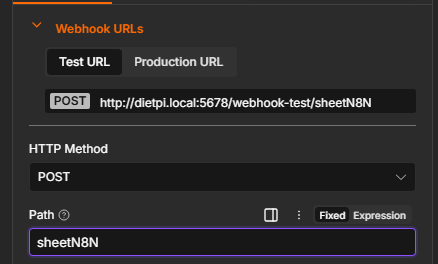

### 6. Conectar n8n con Google Sheets

Se agrega el nodo de Google Sheets, se cargan las credenciales usando el archivo JSON de la cuenta de servicio y se realiza la conexión.

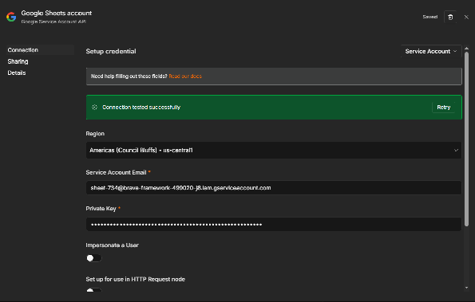

La conexión se establece correctamente:

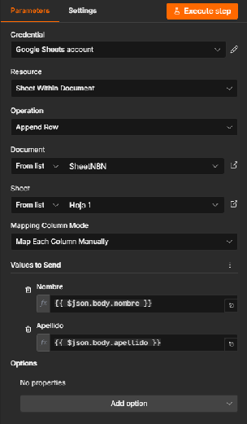

### 7. Mapear los campos del webhook

Una vez conectado, se configuran los campos que se quieren guardar en la hoja, tomando los valores `nombre` y `apellido` directamente del cuerpo (`body`) de la petición del webhook:

```
{{ $json.body.nombre }}
{{ $json.body.apellido }}
```

### 8. Probar el webhook desde n8n

Se activa el modo de prueba en el nodo Webhook (**"Listen for test event"**) para quedar a la espera de una petición:

| Activar escucha de prueba | Webhook esperando datos |
|---|---|
| 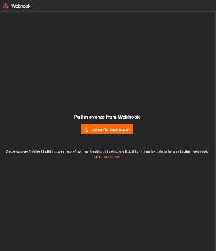 | 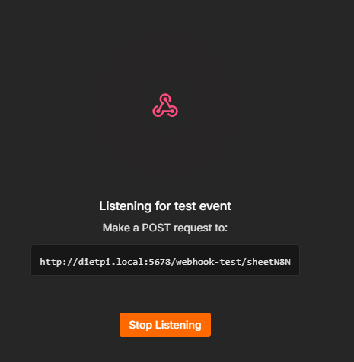 |

### 9. Enviar una petición de prueba con curl

Desde la terminal (`cmd`), se envía una petición `POST` al webhook con datos de ejemplo en formato JSON:

```bash
curl -X POST http://dietpi.local:5678/webhook-test/sheetN8N -H "Content-Type: application/json" -d "{\"nombre\": \"Santiago\", \"apellido\": \"Moglia\"}"
```

### 10. Verificar el resultado

El flujo se ejecuta correctamente en n8n y los datos quedan reflejados en la hoja de Google Sheets:

| Ejecución en n8n | Resultado en Google Sheets |
|---|---|
| 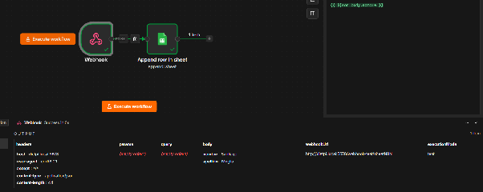 | 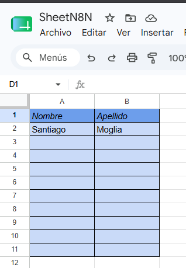 |

## Resultado final

El webhook de n8n recibe los datos enviados por `POST`, los procesa y los inserta automáticamente como una nueva fila en la hoja de Google Sheets configurada, usando una cuenta de servicio para la autenticación.

## 🛠️ Tecnologías utilizadas

- **n8n** (self-hosted sobre DietPi)
- **Google Cloud Platform** (Drive API, Sheets API)
- **Google Sheets**
- **cURL** para pruebas de webhook
